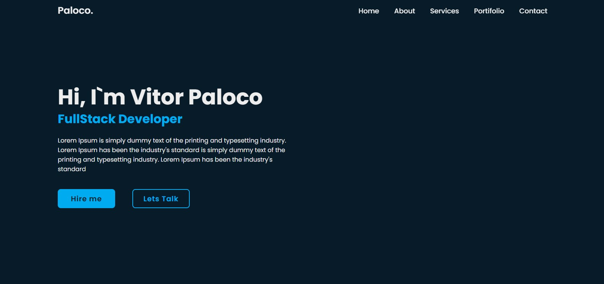

<!DOCTYPE html>
<html lang="en">
<head>
    <meta charset="UTF-8">
    <meta name="viewport" content="width=device-width, initial-scale=1.0">
</head>
<body>
  <h1>README - Meu Portfólio</h1>

  

  <h2>Descrição do Projeto</h2>
  
O projeto "Portfólio" é uma página web que apresenta meu portfólio pessoal, destacando minhas habilidades, projetos e experiências profissionais. É uma maneira de compartilhar meu trabalho e conhecimento com outras pessoas interessadas em conhecer mais sobre mim e minhas capacidades como desenvolvedor.

  <h2>Recursos e Funcionalidades</h2>
  <ul>
      <li>Página inicial com uma breve apresentação e informações sobre mim.</li>
      <li>Seção de projetos, exibindo detalhes e links para projetos que desenvolvi.</li>
      <li>Informações sobre minhas habilidades técnicas e áreas de interesse.</li>
      <li>Detalhes de experiências profissionais relevantes.</li>
      <li>Formulário de contato para que interessados possam entrar em contato diretamente.</li>
  </ul>

  <h2>Tecnologias Utilizadas</h2>
  <ul>
      <li>HTML5 e CSS3 para a estruturação e estilização da página.</li>
      <li>JavaScript para interações e funcionalidades dinâmicas (caso aplicável).</li>
    </ul>

  <h2>Contato</h2>
  
Se você tiver alguma dúvida, sugestão ou quiser entrar em contato comigo, sinta-se à vontade para me enviar um e-mail em <a href="mailto:vitor.paloco@edu.unifil.com">vitor.paloco@edu.unifil.com</a> ou me encontrar em <a href="https://www.linkedin.com/in/vitor-hugo-oliveira-paloco-b64126278/">LinkedIn</a>.

</body>
</html>

